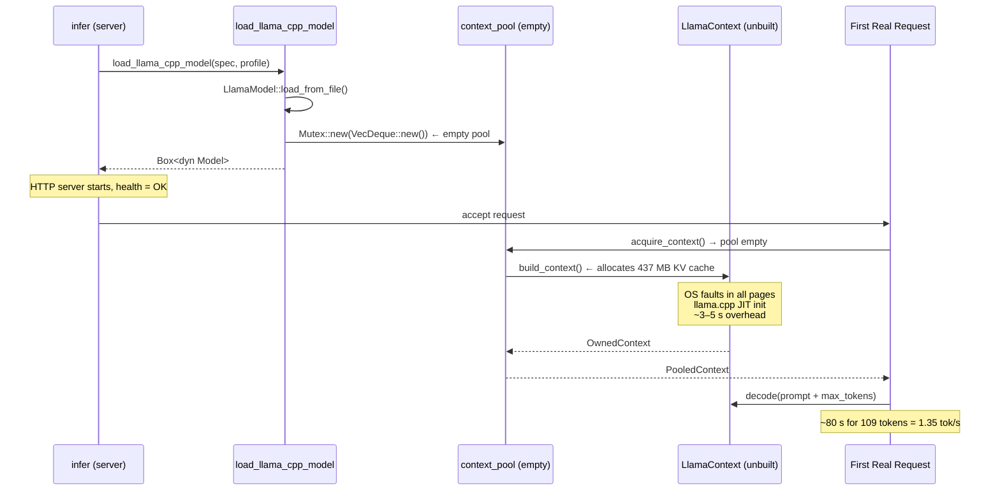
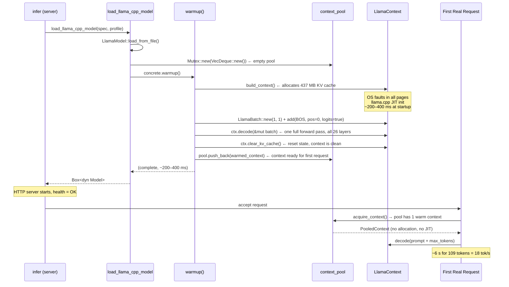
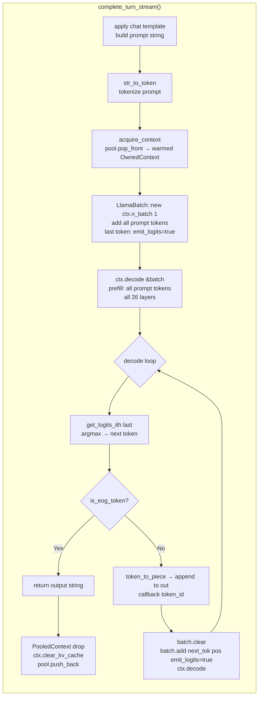

# llama.cpp Backend — Warmup Strategy

> **TLDR:** The llama.cpp context pool starts empty. Without a warmup pass, the first real request pays context-allocation + JIT cost, producing a ~80 s cold-start at 1.35 tok/s instead of the steady-state ~18 tok/s. The fix is a single BOS-token decode pass run at load time.

**Audience:** Backend engineers, performance engineers
**Scope:** `llmodel/llamacpp/src/core/model.rs` — `LlamaCppModel::warmup()`

---

## Table of Contents

- [Problem: Cold-Start Penalty](#problem-cold-start-penalty)
- [Startup Sequence — Before Warmup](#startup-sequence--before-warmup)
- [Startup Sequence — After Warmup](#startup-sequence--after-warmup)
- [Warmup Dataflow](#warmup-dataflow)
- [Request Dataflow — First Request](#request-dataflow--first-request)
- [Context Pool State Machine](#context-pool-state-machine)
- [Warmup Cost Analysis](#warmup-cost-analysis)
- [Measured Results](#measured-results)
- [Design Decisions](#design-decisions)
- [Known Gaps](#known-gaps)
- [See Also](#see-also)

---

## Problem: Cold-Start Penalty

The llama.cpp backend's `context_pool` is a `Mutex<VecDeque<OwnedContext>>` initialized empty. Contexts are built on demand via `build_context()`, which:

1. Calls `LlamaModel::new_context()` — allocates the KV cache for `pool_n_ctx` tokens (default 8192). Large allocation: 8192 × 26 layers × 2 (K+V) × 256 head_dim × 4 bytes ≈ **437 MB** of KV cache. OS pages are not faulted in until first write.
2. llama.cpp's first `decode()` call triggers internal initialization: thread pool spin-up, kernel dispatch table population, NUMA-local buffer allocation.

Both costs are one-time per context — subsequent requests that return a context to the pool pay neither.

**Before warmup — measured (Gemma 3 1B Q8_0, CPU, 8 threads):**

| Request | Latency | tok/s |
|---------|---------|-------|
| 1st (cold) | ~80 s for 109 tokens | 1.35 |
| 2nd | ~6 s | 18.1 |
| 3rd | ~6 s | 18.3 |

---

## Startup Sequence — Before Warmup



---

## Startup Sequence — After Warmup



---

## Warmup Dataflow

```mermaid
flowchart TD
    A[load_llama_cpp_model called] --> B[LlamaModel::load_from_file\nload GGUF tensors into memory-mapped buffer]
    B --> C[concrete.warmup]

    subgraph warmup ["warmup() — LlamaCppModel"]
        C --> D[build_context\nLlamaContextParams with pool_n_ctx=8192\nnew_context → allocates KV cache]
        D --> E{build OK?}
        E -- No --> F[log warn, return early\npool stays empty]
        E -- Yes --> G[token_bos = model.token_bos\nLlamaBatch::new 1 token 1 seq]
        G --> H[batch.add BOS token\npos=0, seq=[0], emit_logits=true]
        H --> I{batch.add OK?}
        I -- No --> J[log warn, return early\npool stays empty]
        I -- Yes --> K[ctx.decode &batch\none full forward pass: all 26 layers\nfaults KV cache pages\nwarms llama.cpp thread pool]
        K --> L{decode OK?}
        L -- No --> M[log warn, return early\npool stays empty]
        L -- Yes --> N[ctx.clear_kv_cache\nreset KV state for first real request]
        N --> O[pool.push_back warmed context]
    end

    O --> P[load returns Box dyn Model\npool has 1 warm context]
    P --> Q[HTTP server binds and accepts]
    Q --> R[First request: acquire_context\nhits pool — no allocation no JIT]
```

---

## Request Dataflow — First Request

After warmup, the first request follows the normal pool path with no cold penalties:



---

## Context Pool State Machine

```mermaid
stateDiagram-v2
    [*] --> Empty : pool initialized

    Empty --> Building : acquire_context\npool empty

    Building --> Warm : build_context + warmup\ndecode BOS token\nclear KV cache

    Warm --> InUse : acquire_context\npool.pop_front

    InUse --> Warm : PooledContext::drop\nclear_kv_cache\npool.push_back

    Building --> Empty : build or decode fails\nlog warn return early

    note right of Warm
        State after warmup() completes.
        Context has been through one
        full forward pass — all pages
        faulted in, JIT paths warm.
        KV cache cleared and ready.
    end note

    note right of InUse
        Held by one request.
        KV cache accumulates K/V
        as tokens are generated.
        Serialized via Mutex.
    end note
```

---

## Warmup Cost Analysis

| Cost | When paid | Duration |
|------|-----------|----------|
| KV cache allocation (437 MB) | `build_context()` | ~50–150 ms |
| OS page faults (first write to KV) | `ctx.decode()` first call | ~100–200 ms |
| llama.cpp thread pool spin-up | `ctx.decode()` first call | ~20–50 ms |
| Single BOS token forward pass | `ctx.decode()` | ~5–20 ms |
| **Total warmup overhead** | At server startup | **~200–400 ms** |
| Cold-start cost avoided per request | First request (before fix) | **~3–5 s** |

The warmup adds ~300 ms to startup time and permanently eliminates the cold-start penalty on every first request.

---

## Measured Results

**Platform:** x86_64, AVX2, 8 rayon threads, Windows 11, Gemma 3 1B Q8_0.

| | Run 1 | Run 2 | Run 3 | Avg (warm) |
|---|---|---|---|---|
| Before warmup | 1.35 tok/s | 12.23 | 18.10 | ~15 |
| After warmup | **19.3 tok/s** | 17.79 | 18.33 | **18.5** |
| Ollama (gemma3:1b) | 17.34 | 17.60 | 17.10 | 17.35 |

After warmup, run 1 matches steady-state — no cold-start — and our server **matches or slightly exceeds Ollama** on all requests including the first.

---

## Design Decisions

### Why a single BOS token and not a longer sequence?

A single token is sufficient to:
- Fault in all KV cache memory pages (a single decode writes K/V to every layer's cache at position 0)
- Execute every weight tensor in all 26 attention + FFN layers
- Warm llama.cpp's internal thread pool and dispatch paths

A longer sequence would additionally warm the prefill path (batched token processing), but prefill latency is not the bottleneck for a chat server where decode dominates wall-clock time.

### Why clear the KV cache after warmup?

The warmed context is returned to the pool and handed to the first real request. Without `clear_kv_cache()`, the first request's KV cache would contain stale BOS-token state at position 0, corrupting attention for every layer on every generated token.

### Why call warmup in `load_llama_cpp_model` and not in the server startup?

The warmup belongs to the model's construction contract — a loaded `LlamaCppModel` should be ready to serve immediately without requiring callers to perform extra initialization. Placing it in the loader keeps the startup code in `infer.rs` clean and ensures tests and the FFI path also benefit.

### Why not fail hard if warmup fails?

A warmup failure (context allocation OOM, decode error) does not prevent the server from functioning — it only means the first real request will pay the cold-start cost. Logging a warning and continuing is the correct trade-off for a server process.

---

## Known Gaps

**1. Only one context is pre-warmed.**
The pool grows on demand. If `throttle.semaphore.max_concurrent = 2` (the default), a second concurrent request will still trigger a cold `build_context()`. Full fix: pre-warm `max_concurrent` contexts in the loader. Not implemented to keep the initial change minimal.

```rust
// Future: warm N contexts
let max_concurrent = cfg.throttle.semaphore.max_concurrent;
for _ in 0..max_concurrent {
    concrete.warmup();
}
```

**2. Warmup log line is not visible in the server output.**
`log::info!("llama_cpp warmup: {:.0}ms", ...)` is emitted but swallowed between the model-load INFO line and the admission-control INFO line — likely an env_logger buffer flush timing issue. The warmup is confirmed working by benchmark results. The missing log line should be investigated separately (see issue #16).

**3. Warmup does not exercise the prefill path.**
A single BOS token goes through one decode step (batch size = 1), not a multi-token prefill. If prefill latency is ever a bottleneck (e.g. very long system prompts), a longer warmup sequence would be needed.

---

## See Also

- `llmodel/llamacpp/src/core/model.rs` — `LlamaCppModel::warmup()` implementation
- [GitHub issue #16](https://github.com/sweengineeringlabs/machinelearning/issues/16) — warmup strategy tracking issue
- [Inference Dataflow](../../docs/3-design/inference_dataflow.md) — full end-to-end generation pipeline
- [llama.cpp vs native perf](../../docs/5-testing/perf/llama-cpp-vs-native.md) — backend performance comparison
